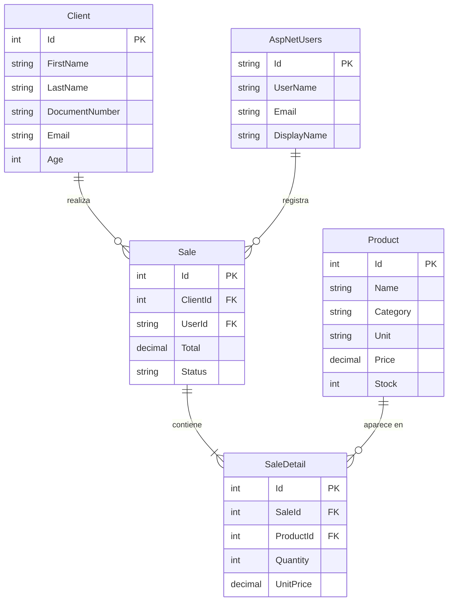

# Firmeza — Panel Administrativo de Materiales de Construcción

Sistema web administrativo desarrollado con **ASP.NET Core 10 Razor Pages** para gestionar productos, clientes y ventas de una distribuidora de materiales de construcción.

---

## Tecnologías utilizadas

| Capa | Tecnología |
|---|---|
| Framework web | ASP.NET Core 10 Razor Pages |
| Base de datos | PostgreSQL 16 |
| ORM | Entity Framework Core 10 + Npgsql |
| Autenticación | ASP.NET Core Identity |
| Estilos | Tailwind CSS (CDN) + Bootstrap Icons |
| Pruebas | xUnit |
| Contenedores | Docker + docker-compose |
| Importación Excel | EPPlus 8 |
| Exportación / Recibos | QuestPDF 2026 |

---

## Arquitectura del proyecto

El proyecto sigue una arquitectura de **3 capas** (Clean Architecture simplificada):

```
Firmeza/
│
├── src/
│   ├── Firmeza.Core/               ← Capa de dominio
│   │   ├── Entities/               ← Entidades del negocio (Product, Client, Sale, SaleDetail)
│   │   ├── Interfaces/             ← Contratos de acceso a datos e email
│   │   └── Enums/                  ← Constantes de roles (Admin, Customer, Cliente)
│   │
│   ├── Firmeza.Infrastructure/     ← Capa de infraestructura
│   │   ├── Data/                   ← ApplicationDbContext (EF Core)
│   │   ├── Identity/               ← ApplicationUser (extiende IdentityUser)
│   │   ├── Services/               ← Implementación de servicios (SmtpEmailService)
│   │   └── Migrations/             ← Migraciones generadas automáticamente por EF
│   │
│   ├── Firmeza.Web/                ← Capa de presentación (Razor Pages)
│   │   ├── Pages/                  ← Páginas Razor (Auth, Dashboard, Products, Clients, Sales)
│   │   ├── ViewModels/             ← DTOs con validaciones para las vistas
│   │   ├── wwwroot/                ← Archivos estáticos (CSS, JS, librerías)
│   │   ├── Program.cs              ← Punto de entrada y configuración de servicios
│   │   ├── appsettings.json        ← Configuración de conexión y logging
│   │   └── Dockerfile              ← Imagen Docker del proyecto web
│   │
│   ├── Firmeza.Api/                ← Capa de servicios RESTful [NEW]
│   │   ├── Controllers/            ← Controladores API (Auth, Products, Clients, Sales)
│   │   ├── Dtos/                   ← Data Transfer Objects
│   │   ├── Mappings/               ← Perfiles de mapeo (AutoMapper)
│   │   ├── Program.cs              ← Punto de entrada y middleware de la API
│   │   ├── appsettings.json        ← Configuración de la API (DB, JWT, SMTP)
│   │   └── Dockerfile              ← Imagen Docker de la API
│   │
│   └── Firmeza.Client/             ← Portal de clientes (SPA React) [NEW]
│       ├── src/                    ← Vistas, componentes y ruteo en React
│       ├── package.json            ← Configuración del proyecto y Tailwind CSS v4
│       └── Dockerfile              ← Imagen Docker de producción (Nginx)
│
└── tests/
    └── Firmeza.Tests/              ← Pruebas unitarias con xUnit
        ├── Core/                   ← Pruebas de entidades del dominio
        └── Web/                    ← Pruebas de lógica de presentación y API
```

### ¿Por qué esta separación?
- **Core**: No depende de nada externo — puro C#. Si cambias la base de datos o el framework, Core no cambia.
- **Infrastructure**: Se encarga del acceso a datos, persistencia en la base de datos y envío de correos.
- **Web**: Panel administrativo interno desarrollado con Razor Pages.
- **Api**: Backend RESTful que expone la lógica de negocio y endpoints seguros mediante JWT.
- **Client**: Aplicación SPA independiente en React para que los clientes finales compren materiales.

---

## Modelo de datos



---

## Sistema de roles

| Rol | Acceso |
|---|---|
| `Admin` | Acceso completo al panel Razor y API (dashboard, productos, clientes, ventas) |
| `Customer` | Solo puede registrarse. **No puede acceder al panel Razor.** |
| `Cliente` | Representa usuarios que compran desde el portal Blazor. Acceso exclusivo a endpoints de la API. |

Al registrarse un usuario público en Razor, queda con el rol `Customer`. En la API de registro, por defecto se le asigna el rol `Cliente`.
Los admins se crean via seed al arrancar la aplicación.

### Usuario administrador por defecto
```
Email:    admin@firmeza.com
Contraseña: Admin123!
```
> Este usuario se crea automáticamente la primera vez que la app arranca.

---

## Instalación y ejecución local con Docker (Recomendado)

Este enfoque garantiza la calidad y reproducibilidad completa del entorno mediante un único comando, ejecutando pruebas automatizadas antes de iniciar cualquier servicio del sistema.

### Requisitos previos
- **Docker** y **Docker Compose** instalados en el sistema.

### Instrucciones de Despliegue Orquestado

Este enfoque garantiza la reproducibilidad del entorno sin requerir la instalación local del SDK de .NET ni la configuración manual del motor de base de datos.

1. Inicializar el ecosistema del backend (Base de datos, API RESTful y Panel Web):
   ```bash
   docker-compose up --build -d
   ```
   > **Nota:** La aplicación de migraciones y el *seeding* de datos se ejecutan automáticamente durante el inicio.
   > - Panel de administración disponible en: `http://localhost:8080`
   > - API RESTful disponible en: `http://localhost:5000`

2. Compilar e inicializar el módulo frontend:
   ```bash
   cd src/Firmeza.Client
   npm install
   npm run dev
   ```
   > - Portal de clientes disponible en: `http://localhost:5173`

---

## Ejecutar las pruebas

```bash
dotnet test tests/Firmeza.Tests
```

Resultado esperado: **24 pruebas pasando, 0 fallando**.

---

## Funcionalidades implementadas

### Autenticación
- Login con validación de rol — si un `Customer` intenta entrar al panel, se le bloquea.
- Registro público de clientes — cualquier persona puede crear una cuenta como `Customer`.
- Logout desde el sidebar.
- Página de acceso denegado (403).

### Dashboard
- Total de productos, clientes, ventas e ingresos.
- Tabla de últimas 5 ventas con estado (Pending / Completed / Cancelled).
- Alerta de productos con stock menor a 10 unidades.

### Gestión de Productos
- CRUD completo: crear, listar, editar, eliminar.
- Búsqueda por nombre.
- Filtrado por categoría (Cemento, Varilla, Pintura, etc.).
- Indicador visual de stock bajo.

### Manejo de errores — Edad
- El campo `Age` del cliente se recibe como texto (`AgeInput`).
- Se convierte con `int.Parse()` dentro de un `try-catch`.
- Si el usuario escribe letras, se muestra un mensaje claro: *"Age must be a whole number"*.

### Gestión de Clientes
- CRUD completo con validaciones de email, teléfono y documento.
- Búsqueda combinada por nombre completo o número de documento.

### Ventas
- Lista de ventas con filtro por estado y búsqueda por cliente.
- Creación de venta con carrito dinámico (selección de cliente y productos).
- Generación automática de recibo PDF al registrar una venta.
- Botón de descarga del recibo PDF desde el listado y el detalle utilizando un manejador de página dinámico.
- Página de detalle con productos, totales e IVA 19%.

### Importación
- Página `/Import` que acepta archivos `.xlsx`.
- Detección automática de columnas en español e inglés.
- Normalización de datos mezclados (productos, clientes y ventas en la misma hoja), descontando stock de productos e insertando registros vinculados.
- Generación automática de recibos PDF para las ventas importadas.
- Upsert inteligente: inserta si no existe, actualiza si ya existe.
- Log visual de resultados con contadores (incluyendo ventas registradas) y mensajes de error por fila.

### Exportación
- Página `/Export` con descarga directa de Excel y PDF.
- **Excel**: Productos, Clientes y Ventas con encabezados estilizados (EPPlus).
- **PDF**: Reportes con encabezado corporativo, tablas y pie de página (QuestPDF).

---

## API RESTful (Firmeza.Api)

La API RESTful expone endpoints para la gestión del negocio y la integración con aplicaciones clientes (como portales Blazor).

### Características
- **Swagger UI**: Disponible en `http://localhost:5000/swagger` para pruebas interactivas de endpoints.
- **Autenticación JWT**: Permite registrar e iniciar sesión de usuarios y recibir tokens JWT.
- **AutoMapper y DTOs**: Las entradas y salidas de los controladores están mapeadas a DTOs con validaciones.
- **Operaciones de Negocio**:
  - Al registrar un cliente (POST `/api/clients`), se envía un correo de bienvenida.
  - Al registrar una venta (POST `/api/sales`), se valida y descuenta el stock del producto y se envía un correo de confirmación de compra con el detalle.
- **Servicio SMTP**: Envío real de notificaciones por correo electrónico, reemplazable por SMTP empresarial mediante inyección de dependencias (`IEmailService`).

### Endpoints Principales

- **Autenticación (`/api/auth`)**
  - `POST /api/auth/register`: Registrar nuevo usuario (asigna rol `Cliente` por defecto).
  - `POST /api/auth/login`: Iniciar sesión y obtener token JWT.

- **Productos (`/api/products`)**
  - `GET /api/products`: Obtener lista con búsqueda por término (`search`), categoría (`category`) o stock bajo (`lowStock`).
  - `GET /api/products/{id}`: Detalle de producto.
  - `POST /api/products`: Crear producto (Requiere política `AdminOnly`).
  - `PUT /api/products/{id}`: Editar producto (Requiere política `AdminOnly`).
  - `DELETE /api/products/{id}`: Eliminar producto (Requiere política `AdminOnly`).

- **Clientes (`/api/clients`)**
  - `GET /api/clients`: Obtener lista (Requiere token).
  - `GET /api/clients/{id}`: Detalle de cliente.
  - `POST /api/clients`: Crear cliente (Envía correo).
  - `PUT /api/clients/{id}`: Editar cliente.
  - `DELETE /api/clients/{id}`: Eliminar cliente (Requiere política `AdminOnly`).

- **Ventas (`/api/sales`)**
  - `GET /api/sales`: Obtener lista de ventas (Requiere token).
  - `GET /api/sales/{id}`: Detalle de venta.
  - `POST /api/sales`: Registrar venta (Descuenta stock y envía correo).
  - `DELETE /api/sales/{id}`: Eliminar venta (Devuelve stock. Requiere política `AdminOnly`).

---

## Cliente Web (Firmeza.Client)

Módulo SPA desarrollado para que los clientes interactúen directamente con la distribuidora de materiales sin intermediarios.

### Características
- **Tecnologías**: React, Vite, Tailwind CSS v4, Lucide Icons.
- **Autenticación JWT**: Flujo completo de registro de usuarios, login, almacenamiento seguro en LocalStorage y redirección automática al expirar el token.
- **Completar Perfil**: Si un usuario registrado no cuenta con perfil en la tabla de `Clients`, el sistema solicita sus datos de cliente (nombre, apellido, documento, teléfono, dirección, edad) al ingresar por primera vez.
- **Catálogo de Materiales**: Buscador en tiempo real y filtrado por categorías. Etiquetas dinámicas de control de stock y advertencia de stock bajo.
- **Carrito de Compras**: Cálculo en tiempo real de subtotal, IVA del 19% y total general. Control de stock al modificar cantidades.
- **Facturación y Comprobantes**: Al procesar la compra, la API genera un comprobante PDF en memoria y lo envía por correo electrónico al cliente (utilizando el SMTP simulado/real). Además, el frontend ofrece descarga directa del comprobante en PDF.
- **Historial de Compras**: Sección donde el cliente puede visualizar todas sus compras pasadas y volver a descargar los comprobantes en cualquier momento.


---

## Documentación técnica

Los diagramas técnicos se encuentran en `docs/diagrams/`:

- [class-diagram.png](docs/diagrams/class-diagram.png) — Diagrama de clases
- [er-diagram.png](docs/diagrams/er-diagram.png) — Diagrama Entidad-Relación

## Notas de despliegue

- El `Dockerfile` usa compilación en dos etapas (multi-stage build): SDK para compilar, runtime para ejecutar. La imagen final es más liviana.
- Las variables sensibles (contraseña de BD) deben pasarse como variables de entorno en producción, no en `appsettings.json`.
- Las migraciones se aplican automáticamente al arrancar (`database.MigrateAsync()` en `Program.cs`).

---

## Autor

**Sergio Ospina**
